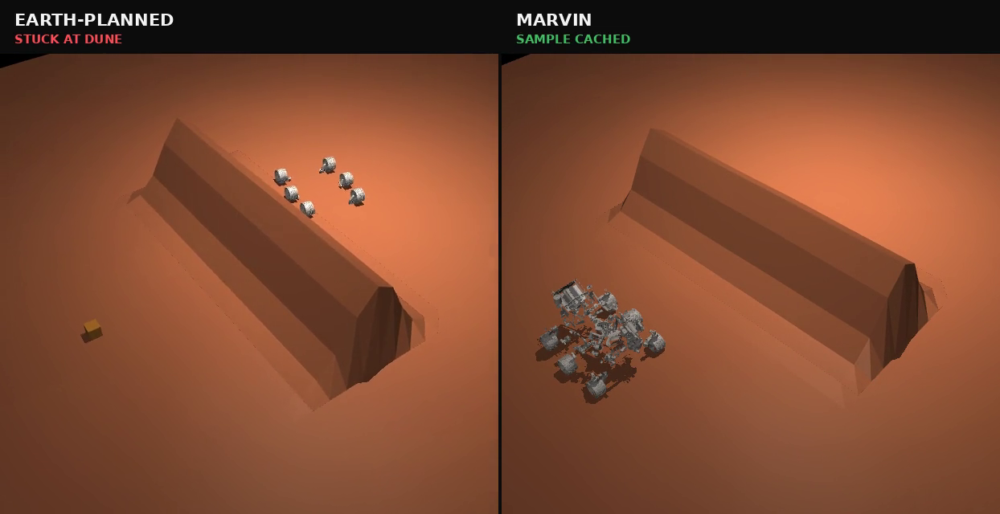
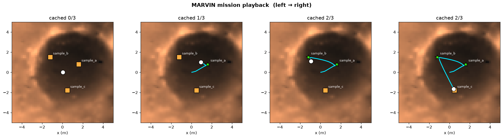
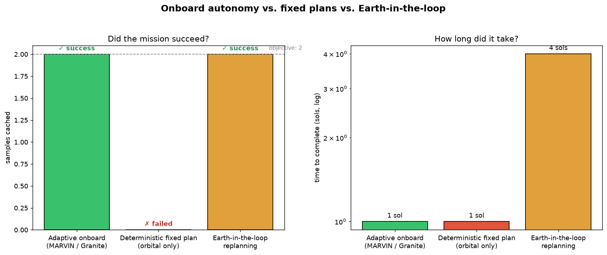

# MARVIN — Mars Autonomous Reasoning & Verification INtelligence

**An onboard, offline mission planner for a planetary rover: a small IBM Granite model
_proposes_ action sequences and a fast probabilistic simulator _verifies_ them under
uncertainty — the model never commands the rover directly.**

[](https://bit.ly/IBMBob-freetrial)
[](https://ollama.com/library/granite4.1)
[](https://www.python.org/)
[](LICENSE)

> **The tiny model proposes; the physics-lite simulator disposes.**

**Challenge theme:** Space Exploration — turning missions from *data-heavy* into
*insight-driven*, decided onboard.

---

## The problem

A Mars rover cannot think for itself. Today it collects data, waits for an Earth comms
window (**light-time delay of 4–24 minutes each way**), and human planners on Earth analyze
the data, build a command sequence, validate it, and uplink it. Rovers receive **roughly one
command cycle per sol** (Martian day), so a science campaign that needs *K* sequential
decisions takes about *K* sols — a 120-decision campaign is **~4 months** of calendar time,
and the rover sits idle or over-conservative between windows. Every irreversible choice funnels
through Earth.

## What MARVIN does

MARVIN moves the *decision-making* onboard. It turns raw perception into **safe, justified
actions between comms windows** — without a heavy world model, without a network, and without
blindly trusting a small model. It doesn't replace navigation or human oversight; it's the
reasoning layer that decides *what to do next* and delegates execution.

## Mission Control — two Granites, one link

MARVIN now runs inside a **Mission Control web console** with two IBM Granite models in the roles
they'd actually hold in a deep-space architecture:

- **HOUSTON** — a **cloud Granite** (watsonx.ai), the *ground segment*. The chatbot you talk to,
  instant (it's on Earth). It expands one operator sentence into a full structured **mission
  briefing** — objectives, science rationale, constraints, and a route advisory drawn from
  **orbital data only**.
- **MARVIN** — the **local `granite4.1:3b`** (Ollama), the *onboard segment*, unchanged. It receives
  the briefing over the simulated Earth–Mars link, then runs the existing perceive → propose →
  verify → gate → execute loop on what its **own sensors** see.

The split isn't a product choice — it's forced by physics: **cloud model for strategy, edge model
for tactics, connected the only way Earth and Mars can be.** The same pattern (cloud planner + edge
executor) is deployable in terrestrial robotics today.

**The beat:** the operator types *"get me a sample from the carbonate outcrop east of the dunes."*
HOUSTON expands it and uplinks a briefing whose orbital advisory says *drive direct — it's shortest*.
The uplink pays the light-time. Then MARVIN's onboard cost map finds the soft-sand ridge orbit
couldn't see, and **downlinks a deviation**: *"Negative on the direct approach — 100% entrapment
across 20 rollouts. Taking the balanced route, 9 m at 0%."* Earth planned from orbit; the rover knew
better. (This is the Purgatory story below, with HOUSTON playing Earth.)

**Invariants** (the thesis, enforced in code): no LLM ever commands an actuator — *the model decides,
the gate approves, the controller drives*; HOUSTON is farther from the wheels than MARVIN; route
advisories are non-binding; and every Earth↔Mars crossing pays the delay (it lives in exactly one
file, [`services/ground/link.py`](services/ground/link.py)).

```bash
# run the console locally (HOUSTON falls back to local Granite without watsonx keys)
.venv/bin/python -m uvicorn services.ground.server:app --port 8000    # then open http://localhost:8000
.venv/bin/python -m services.flow_demo                                # or watch the whole beat headless
```

The headless demos (`demo.cli`, `demo.purgatory`) remain the **offline flight build** — the console
is the ground station on top of them.

## The moment it matters: the Purgatory Dune

On **sol 446 (26 April 2005)**, NASA's *Opportunity* drove straight into a wind-shaped ripple in
Meridiani Planum — later nicknamed **"Purgatory Dune"** — buried its wheels past the hubs, and got
stuck. Freeing it took **38 sols** of careful Earth-side sandbox testing. *Spirit* hit the same
class of soft-soil trap at "Troy" in 2009 and **never escaped**. The rovers couldn't see the trap
coming, because the decision to drive in was made on Earth, from orbital imagery, days ahead.

MARVIN reruns that moment onboard. Its **A\* navigator** turns the DEM height grid into a
traversability cost map — steep ground is costly whether it climbs a dune *or* drops into a hole, and
the penalty **scales with the hazard** (a gentle rise stays cheap to cross; a real dune gets
expensive to touch). A* searches several **candidate roads** at different caution levels; the fast
surrogate ("lightsim") rolls each out **under uncertainty** to predict its entrapment risk; and
**IBM Granite weighs them all** — trading distance against risk — before it commits, with a safety
gate behind it:

| A* road | Length | Entrapment risk (lightsim) | Verdict |
|---------|:------:|:--------------------------:|---------|
| direct (straight at the outcrop) | 2.6 m | **100 %** | drives across the dune, would get stuck |
| **balanced (around the dune)** | 7.8 m | **8 %** | ✅ **Granite's choice — shortest safe road** |
| cautious | 8.1 m | 8 % | safe, but longer |
| safe | 8.4 m | 8 % | safe, widest berth |

> **Decision — IBM Granite:** *"weighed 4 roads and took the balanced one — the direct line is 100 %
> entrapment risk, and among the safe routes it's the shortest. Even though the dune is only ~0.8 m
> high, driving onto soft sand isn't worth it."*

The rover then drives the detour on full MuJoCo physics and samples the outcrop beyond the dune —
**reached ✅, sample cached ✅, 0 sols lost** against Opportunity's 38.



*Same dune, same camera, real MuJoCo physics both sides: the orbital plan (left) drives in and
stalls; MARVIN (right) takes Granite's verified detour and caches the sample. Render it with
`python -m web.render_compare`.*

*Reproduce the run: `python -m demo.purgatory` (headless), `python -m web.render_purgatory` (the
hero rover clip with NASA's public-domain Perseverance mesh), or drive it yourself in the CLI with
`dune` then `route`.*

## Results

- **Completes a full 2-sample mission autonomously** on **IBM Granite 4.1 running locally** —
  5 decisions, **~83 seconds**, 4.2% battery, zero ground contact.
- The fast "imagination" simulator **predicts full-physics outcomes within ~3%**, so every
  plan is *verified against reality*, not guessed.
- **Why onboard autonomy matters** (same terrain, same targets):





A **deterministic fixed plan built from orbital data alone misses the samples** — orbital
localization error (~1 m) is larger than the instrument's reach (0.55 m), so it drives to the
wrong spot. **Earth-in-the-loop replanning** succeeds but turns a 120-decision campaign into
**~4 months**. MARVIN does it between comms windows. *(Watch the full run in
[`docs/figures/mission.gif`](docs/figures/mission.gif).)*

## AI approach & architecture

Each decision cycle:

1. **Perceive** — noisy onboard sensors (camera intrinsics, pose/odometry drift, target
   detection). The planner acts on *perception*, never ground truth.
2. **Propose** — **IBM Granite 4.1** (local, via Ollama, offline) proposes candidate action
   sequences, following a fixed procedure in [`model/SKILL.md`](model/SKILL.md) so a compact
   model plans reliably instead of improvising.
3. **Verify** — a **vectorized NumPy surrogate** rolls each candidate out **20× under injected
   uncertainty** (traction, localization drift, battery draw), calibrated from the real MuJoCo
   world. Sub-millisecond; the model never commands directly.
4. **Gate** — **tail-risk (CVaR)** on the worst 10% of rollouts, plus the 15% battery reserve.
   Unsafe or over-budget plans are dropped.
5. **Value of Information** — take an extra observation *only* when it would actually change
   the decision (never blind data collection).
6. **Execute** — a **reflex** samples the instant the rover is in reach; a **progress
   guarantee** stops the rover ever idling while the objective is unmet; driving goes through a
   plain in-process capability API — **no server, no MCP, no network**.
7. **Replan** on new perception.

**Two simulators, never confused:** MuJoCo is the *real world* (high-fidelity rover physics on
a Mars heightfield, runs once); the surrogate is the planner's *imagination* (cheap, runs 20×
per decision). The surrogate's uncertainty is calibrated from — and measured against — the
MuJoCo world (the ~3% fidelity number above). Full design in [`docs/DESIGN.md`](docs/DESIGN.md).

**Navigation is A\*, judgment is Granite.** Path-finding is a solved problem, so MARVIN doesn't ask
a language model to invent coordinates — it runs **A\*** ([`planner/astar.py`](planner/astar.py))
over the DEM cost map to produce a shortest and a safe route, the lightsim scores each under
uncertainty, and **Granite makes the call** (which route, when to sample, which target) and explains
it. Classical search for the geometry, the LLM for the judgment, the surrogate for the verification.

**MARVIN is an onboard agent.** You talk to it ([`demo/agent.py`](demo/agent.py)): it answers
questions about the terrain and science from the live sensor readout, and turns "collect the
carbonate sample" into a planned, verified, executed drive — Granite orchestrating its tools
(navigator, lightsim, instrument) in one call per turn.

## Real space data

MARVIN runs on **real Jezero terrain**. [`data/fetch_jezero.py`](data/fetch_jezero.py) reads the
Jezero window from NASA/USGS's global **MOLA** DEM via GDAL `/vsicurl/` HTTP range requests (no
multi-GB download) — the mission figures show the actual crater basin and rim. Provenance: real
relief **−2781 to −1543 m over 60 km**, amplitude-normalized to the rover-scale patch (the sim
patch is abstracted; the *morphology* is real). Per-target **science value** comes from
CRISM-style mineralogy (carbonate/clay high — see the [scenario](demo/scenario.py)), and **dust
opacity** drives the solar-power budget. Details in [`docs/DATA.md`](docs/DATA.md).

**The real-time path.** MARVIN consumes these NASA archives *through the same interfaces a flight
build would use for live data* — the archive is a stand-in for a real-time feed we don't have access
to. On an actual rover, the identical `perceive → propose → verify → gate` loop takes onboard
telemetry (hazard cameras, IMU/odometry, power) in place of the archived DEM and mineral maps;
nothing in the architecture assumes the data is static. That's the point of keeping it **offline and
serverless**: MARVIN is designed to drop in as an onboard decision module — between the sensors the
rover already has and the drive system it already trusts — not as a ground tool that phones home.
watsonx and other cloud AI live on Earth, unreachable across the light-time gap; MARVIN deliberately
runs its reasoning on **Granite, onboard**.

## How IBM Bob was used

**IBM Bob was the primary development tool for MARVIN's intelligence layer.** Bob designed and
authored the first working version of the reasoning stack — the parts that make the rover
*think*:

- the **propose-and-verify loop** ([`planner/loop.py`](planner/loop.py)),
- the **vectorized surrogate simulator** ([`planner/surrogate.py`](planner/surrogate.py)),
- the **tail-risk / CVaR gating** ([`planner/gating.py`](planner/gating.py)),
- the **Value-of-Information** logic ([`planner/voi.py`](planner/voi.py)),
- the **explainable decision log** ([`planner/justify.py`](planner/justify.py)),
- the **surrogate calibration + fidelity metric** ([`world/calibrate.py`](world/calibrate.py)),
- the **IBM Granite proposer** ([`model/propose.py`](model/propose.py)),
- and the **test suite**.

Bob's contributions are visible in the git history under the `IBM Bob` author. The MuJoCo
physics simulation, sensors, and capability API were built as the world for Bob's planner to
reason over, and the integrated system was then hardened for reliability (the sample reflex,
the progress guarantee that breaks stall-loops, the Granite swap, and the planning skill).

## Setup & run

```bash
uv venv --python 3.12 .venv
uv pip install --python .venv -r requirements.txt
ollama pull granite4.1:3b          # IBM Granite 4.1, local & offline

.venv/bin/python -m demo.cli        # ⭐ TALK to MARVIN (headless) — ask about the terrain, say "collect the carbonate sample"
.venv/bin/python -m demo.live       # same, with the real MuJoCo 3D window open (needs a display)
.venv/bin/python -m demo.purgatory  # the Purgatory Dune, headless: A* + Granite route around the trap
.venv/bin/python -m demo.run        # full autonomous mission (Granite)
.venv/bin/python -m demo.compare    # onboard vs. fixed-plan vs. Earth-in-the-loop
.venv/bin/python -m web.render_purgatory # render the Purgatory mission video (Perseverance mesh)
.venv/bin/python -m web.build_showcase   # build the interactive showcase page
.venv/bin/python -m pytest          # tests
```

**Talk to the rover.** `demo.cli` (and `demo.live`, with the 3D window) drop you into a conversation
with **MARVIN**, the rover's onboard Granite intelligence:

```
you> hi
MARVIN: Hello, I'm MARVIN, the onboard AI controlling this Mars rover. My mission is to
        autonomously navigate and collect high-value samples while avoiding hazards.
you> what's the terrain like around you?
MARVIN: There's a soft-sand dune ridge ahead along x≈1.0 — driving onto it could strand us.
you> collect the carbonate sample
MARVIN: I'll take the carbonate outcrop at (2.6, 0.0) using the safe path.
        navigator: shortest 2.6 m at 100% risk; taking the safe route 10.1 m at 8% risk.
        reached it and reached out the arm — sample cached.
```

It reads the real space data, runs the A* navigator + lightsim, and drives the verified route — no
teleop, no memorised commands.

## License

MIT — see [`LICENSE`](LICENSE).
